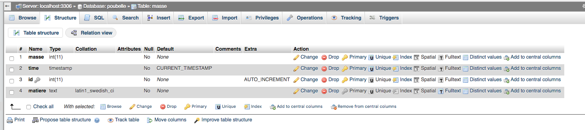

# poubelle.online
le site internet

you need the `connect.php` file that has the creds for the mysql server
only [x4m3](https://philippeloctaux.com) has it

## server requirements
some mysql server for the database stored
a http server + php (i used nginx and some php thing)

here's the mysql structure if you wanna do the same thing: 

## commands to run for phil
`git remote add deploy vps:~/la-poubelle.git`

## git hook on the server
```bash
#!/bin/sh

GIT_REPO=https://github.com/vegapoubelle/poubelle.online.git
TMP_GIT_CLONE=/tmp/la-poubelle
PUBLIC_WWW=/srv/www/poubelle.online

echo "starting"
git clone $GIT_REPO $TMP_GIT_CLONE --depth=1
echo "git repo cloned"
cd $TMP_GIT_CLONE
echo "building"
cp ~/poubelle-connect.php src/php/connect.php
cp src/* $PUBLIC_WWW -r -v
rm -Rf $TMP_GIT_CLONE
echo "built and ready to be served"
exit
```
